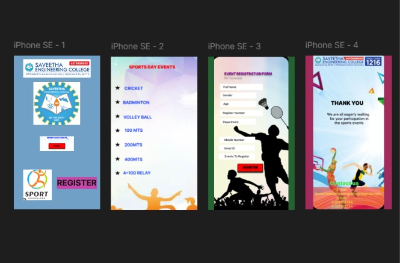

# Ex09 Event Registration Web Application
## Date:17/12/25
### Ref:25018612

## AIM:
To design, develop and deploy a web application for event registration.

## DESIGN STEPS:

### Step 1:
Create a new frame.

### Step 2:
Select any one preset size of your choice.

### Step 3:
Select the shapes you need.

### Step 4:
Import images as needed.

### Step 5:
Create pages based on your need and link them.

### Step 6:

Validate the HTML and CSS code.

### Step 6:

Publish the website in the given URL.

## DESIGN TOOL:
Figma

## CODE:
```
page1.html

<style>
    body {
      margin: 0;
      display: flex;
      justify-content: center;
      align-items: center;
      height: 100vh;
      background: #f5f5f5; /* light background */
      font-family: 'Inter', sans-serif;
    }

    .container {
      width: 100%;
      height: 100%;
      display: flex;
      flex-direction: column;
      justify-content: center;
      align-items: center;
    }

    .box1 {
      width: 190px;
      height: 48px;
      background: #e0e0e0; /* placeholder box color */
      margin: 5px;
    }

    .box2 {
      width: 170px;
      height: 48px;
      background: #cfcfcf; /* placeholder box color */
      margin: 5px;
    }

    .register-text {
      color: #0903FF;          /* bright blue */
      font-size: 32px;
      font-weight: 700;
      margin-top: 20px;
    }
  </style>
  <div class="container">
    <div class="box1"></div>
    <div class="box2"></div>
    <p class="register-text">REGISTER</p>
  </div>

page2.html

<title>Sports Day Events</title>
  <style>
    body {
      margin: 0;
      font-family: Arial, sans-serif;
      background: linear-gradient(to bottom right, #ffffff, #d4f0ff);
      text-align: center;
    }

    h1 {
      color: #FF2E63; /* pink heading */
      font-size: 26px;
      margin: 20px 0;
      font-weight: bold;
    }

    ul {
      list-style: none;
      padding: 0;
      margin: 0 auto;
      width: fit-content;
      text-align: left;
    }

    ul li {
      font-size: 20px;
      color: #000;
      margin: 12px 0;
      font-weight: 500;
    }
  </style>
  <h1>SPORTS DAY EVENTS</h1>
  <ul>
    <li>CRICKET</li>
    <li>BADMINTON</li>
    <li>VOLLEY BALL</li>
    <li>100 MTS</li>
    <li>200 MTS</li>
    <li>400 MTS</li>
    <li>4×100 RELAY</li>
  </ul>

page3.html

<title>Event Registration Form</title>
  <style>
    body {
      margin: 0;
      font-family: Arial, sans-serif;
      background: linear-gradient(to bottom right, #f8f8f8, #d0ffd6);
      display: flex;
      justify-content: center;
      align-items: center;
      height: 100vh;
    }

    .form-box {
      background: #ffffffcc;
      padding: 20px;
      border-radius: 10px;
      box-shadow: 0 4px 12px rgba(0,0,0,0.2);
      width: 300px;
    }

    h2 {
      text-align: center;
      color: #ff0055;
      font-size: 20px;
      margin-bottom: 20px;
    }

    label {
      display: block;
      margin-top: 10px;
      font-weight: bold;
      color: #333;
    }

    input {
      width: 100%;
      padding: 8px;
      margin-top: 5px;
      border: 1px solid #ccc;
      border-radius: 6px;
      font-size: 14px;
    }

    .submit-btn {
      margin-top: 15px;
      width: 100%;
      padding: 10px;
      font-size: 16px;
      font-weight: bold;
      background: #e91e63;
      color: white;
      border: none;
      border-radius: 6px;
      cursor: pointer;
    }

    .submit-btn:hover {
      background: #c2185b;
    }
  </style>
  <div class="form-box">
    <h2>EVENT REGISTRATION FORM</h2>
    <form>
      <label>Full Name</label>
      <input type="text">

      <label>Gender</label>
      <input type="text">

      <label>Age</label>
      <input type="number">

      <label>Register Number</label>
      <input type="text">

      <label>Department</label>
      <input type="text">

      <label>Mobile Number</label>
      <input type="text">

      <label>Email ID</label>
      <input type="email">

      <label>Events to Register</label>
      <input type="text">

      <button class="submit-btn">REGISTER</button>
    </form>
  </div>
page4.html

<title>Thank You</title>
  <style>
    body {
      margin: 0;
      font-family: Arial, sans-serif;
      background: linear-gradient(to bottom right, #ffffff, #ffdde1);
      text-align: center;
      display: flex;
      flex-direction: column;
      justify-content: center;
      align-items: center;
      height: 100vh;
    }

    h1 {
      font-size: 24px;
      color: #000;
      margin-bottom: 10px;
    }

    p {
      font-size: 16px;
      color: #333;
      margin-bottom: 30px;
    }

    .contact-btn {
      background: #00b894;
      color: white;
      font-size: 16px;
      font-weight: bold;
      padding: 10px 20px;
      border: none;
      border-radius: 8px;
      cursor: pointer;
    }

    .contact-btn:hover {
      background: #009874;
    }
  </style>
  <h1>THANK YOU</h1>
  <p>We are all eagerly waiting for your participation in the sports events</p>
  <button class="contact-btn">Contact Us</button>

```

## OUTPUT:


## RESULT:
The program to design, develop and deploy a web application for event registration is completed successfully.
